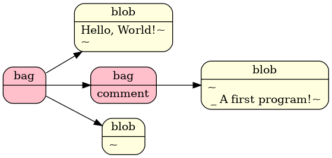
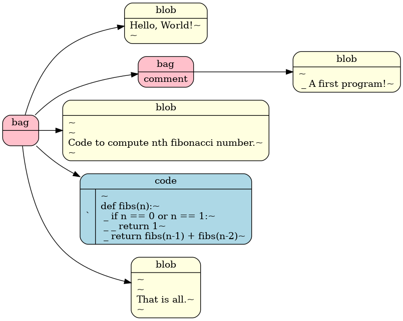

# Brashtag

Brashtag is a notation for specifying trees. Purpose of the notation is to allow you to 
surround a piece of text with hints that programs can later exploit.

#### The notation
There are three kinds of nodes blobs, bags, codes.

- Blobs contain text. 
- Bags contain blobs, codes and other bags. They can be tagged.
- Codes also contain text. More on them later.

The following snippet constructs tree with a bag tagged `"card"` that contains 
two bags tagged `"front"` and `"back"`. The bag tagged `"front"` contains a blob 
with text `"This is front."`. The bag tagged `back` contains a blob with text 
`"This is back."`.

```
#card{
   #front{
      This is front.
   } 
   #back{
      This is back.
   }
}
``` 

Any text is allowed inside tags and blobs except these four characters `#`, `{`, `}`, `$`. 
Because these characters are also used by the notation. If you want to 
put text with those characters in the tree you have to surround it by `$`. That creates 
a node of kind code. You need to surround the code node with more `$` signs than maximum
number of consecutive `$` inside its text. 

Following snippet constructs a code node with tag `$` and `func main() { fmt.Println("Hello") }` text.

```
$
func main() { fmt.Println("Hello") }
$
```

And this snippet constructs a code node with tag `$$` and `PATH=$PATH:/foo/bar` text.
```
$$
PATH=$PATH:/foo/bar
$$
```

#### Examples Texts and Corresponding Trees 

###### One
```
Hello, World!
```


###### Two
```
Hello, World!

#comment{
    A first program!
}
```


###### Three
```
Hello, World!

#comment{
    A first program!
}

Code to compute nth fibonacci number.

$
def fibs(n):
    if n == 0 or n == 1:
        return 1
    return fibs(n-1) + fibs(n-2)
$
```


###### Four
```
Hello, World!

#comment{
    A first program!
}

Code to compute nth fibonacci number.

$
def fibs(n):
    if n == 0 or n == 1:
        return 1
    return fibs(n-1) + fibs(n-2)
$

That is all.
```



#### Some Programs

These are quickly hacked together, unpolished programs. 
Making this kind of hacking easy is what this notation is invented for. 

- [barkdown](/cmd/barkdown) - converts brashtag to html. 
- [carter](/cmd/carter) - flashcards study program. 
- [tree](/cmd/todot) - outputs brashtag tree in dot format from a brashtag document.


#### TODO
- Write tests. 
- Better error reporting. 
- Write tutorial. 
- Write docs.